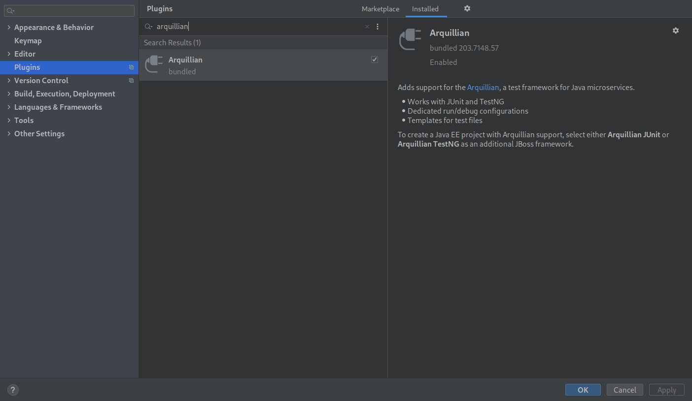
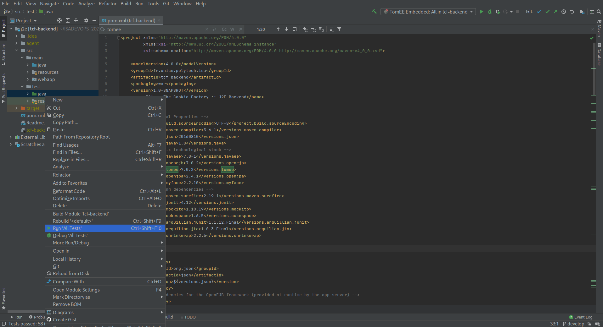
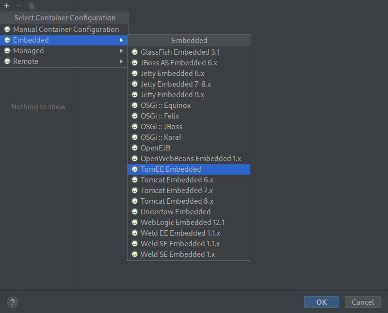
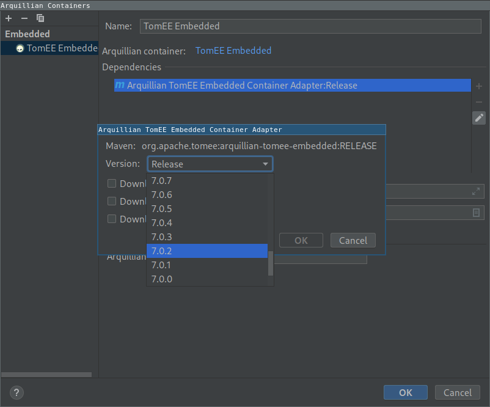
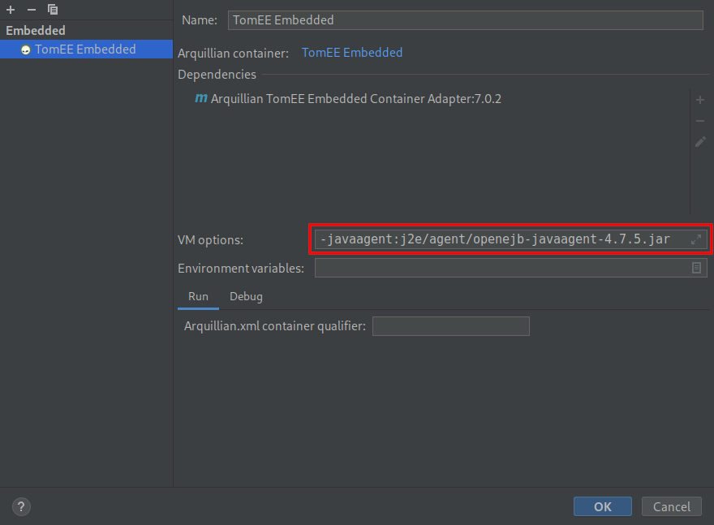
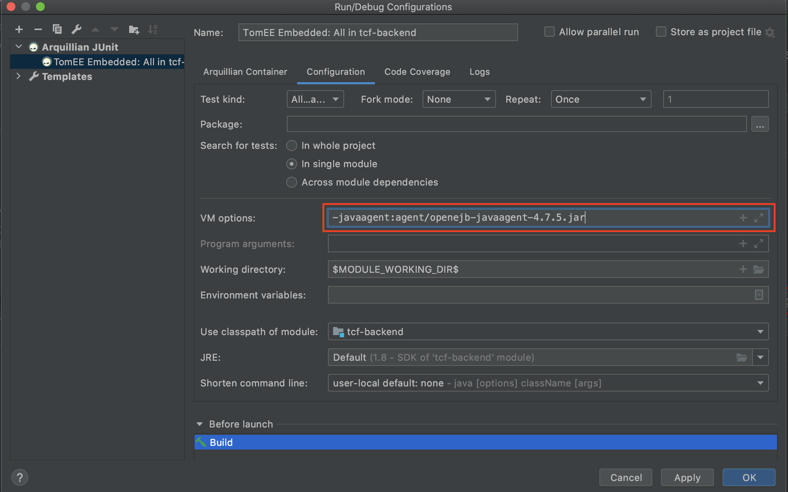

# Setting up IntelliJ

  - Author: Sebastien Mosser
  - Version: 02.2017

## IDE Version & Plugins

With respect to the tools and frameworks we are using in this course, it is more useful to rely on the IntelliJ Ultimate Edition. As a student, you can register to the [Jetbrains Academic Licensing](https://www.jetbrains.com/community/education/#students) and get a license for free.

To support testing inside the application container, we rely on the Arquillian framework. Be sure that the "Arquilian Plugin" is enabled.

## Running Tests with Arquillian

Arquillian allows one to transparently start an application container, deploy the application inside and run tests suites.

The run must be configured to specify which Application container must be used. In our case, we rely on TomEE, and considering it is specified in the maven pom.xml files, the IDE automatically propose to select it.

  

If the IDE doesn't automatically suggest it, the Arquillian Container can be manually selected by clicking on "Configure".

The required TomEE Embedded version [as declared in the pom.xml](../../j2e/pom.xml) is `7.0.2`. This configuration can generate problems and it's a good practice to manually select it.

Unfortunately, the arquillian plugin does not support automatic enhancement of classes, which is necessary for OpenJPA to make classes persistent. We need to delegate this behaviour to a _java agent_, by specifying its path in the JVM options. The path is relative to the root of your IntelliJ Project.

In this example, we use `openejb-javaagent` ([download link](http://maven.org/maven2/org/apache/openejb/openejb-javaagent/4.7.5/openejb-javaagent-4.7.5.jar)) in `j2e/agent` subfolder.
We then have to set `-javaagent:j2e/agent/openejb-javaagent-4.7.5.jar` as a VM option for TomEE tests launching. See picture below.

The path can also be `-javaagent:agent/openejb-javaagent-4.7.5.jar` if the j2e project is directly open in Intellij (and not the whole 4A_ISA_TheCookieFactory project).

